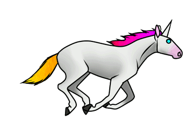

# Personal Computing 💅🏽
---
---
---

¯¯̿̿¯̿̿'̿̿̿̿̿̿̿'̿̿'̿̿̿̿̿'̿̿̿)͇̿̿)̿̿̿̿ '̿̿̿̿̿̿\̵͇̿̿\=(•̪̀●́)=o/̵͇̿̿/'̿̿ ̿ ̿̿
▬▬ι═══════ﺤ    -═══════ι▬▬ ס₪₪₪₪§|(Ξ≥≤≥≤≥≤ΞΞΞΞΞΞΞΞΞΞ>

## Overview

In this workshop, we will be examining and creating contemporary art that is made to be experienced on/over personal computing devices such as computers and cell phones.

Since the 1980's artist's have been making art which is meant to be experienced over networks. This expanding field is (generally) called net art.

The great thing about this type of art is many works can be experienced through a web browser at home, or on a cell phone, or in a class room. Taking advantage of this accessibility, we will be looking at seminal examples of net art from the last 30 years. And again, as a reminder, we will not be looking at photocopies, or slides, or installation shots, but the actual works themselves live and in our browsers!

We will be working towards an informal, and private online exhibition on ... Friday the last day of the workshop!. 

The workshop is organised as a crash course in all things related to anything I can think of in making online work, and putting together an online exhibition. It's going to be fast paced, a bit un-focused, and I'll try to cram as much information in as I can in the 5 days. Don't worry if you miss something, because we will keeping track of everyting on the social network Are.na - which will be a big part of the class. We will start with the basics and focus on a framework to discuss the seemingly simple question - what is contemporary art? And working from there we will dive into contemporary art and all it's online permutations, with a healthy dose of fringe experiences regarding our digital daily lives.

## Requirements

Familiarity with personal computing devices. Proficiency in English. A cell phone. Open to all students.

## Instructor

Cory Arcangel  

## Class Website 

Ƹ̵̡Ӝ̵̨̄Ʒ
Ƹ̵̡Ӝ̵̨̄Ʒ
Ƹ̵̡Ӝ̵̨̄Ʒ
Ƹ̵̡Ӝ̵̨̄Ʒ
Ƹ̵̡Ӝ̵̨̄Ʒ
Ƹ̵̡Ӝ̵̨̄Ʒ

[http://personal-computing.coryarcangel.com](http://personal-computing.coryarcangel.com)

Ƹ̵̡Ӝ̵̨̄Ʒ
Ƹ̵̡Ӝ̵̨̄Ʒ
Ƹ̵̡Ӝ̵̨̄Ʒ
Ƹ̵̡Ӝ̵̨̄Ʒ
Ƹ̵̡Ӝ̵̨̄Ʒ
Ƹ̵̡Ӝ̵̨̄Ʒ

## Details

We will be meeting 900-1600 every day with a lunch break between 12:00-1:00. An important deviation is THE FIRST DAY in which we will meet at 9:30. The time before and after class can be used for readings, or web surfing, or unstructured time". 

All class notes, and breadcrums, sub edits, tangents, related things, etc, etc, will be kept track with are.na on a private channel. If you are unfamiliar with Are.na, we will be doing an Are.na workshop on the first day of class:  
[https://www.are.na/personal-computing-filmkunstskolen-i-kabelvag/index](https://www.are.na/personal-computing-filmkunstskolen-i-kabelvag/index).  

## Structure

This class will meet for one week - from 9am to 4pm. The structure - which is broken up into 45 min hour long modules - will ping pong between lectures 🤦‍, site visits to different spaces 🏤, film screenings 📺, readings 📒, discussions 👑, and games / projects 👾, and finally an exhibition 🖼. 

((̲̅ ̲̅(̲̅C̲̅r̲̅a̲̅y̲̅o̲̅l̲̲̅̅a̲̅( ̲̅((>

## 📒 Readings

[📒 Assigned readings](https://www.are.na/personal-computing-filmkunstskolen-i-kabelvag/readingz-xvzce_bexse) Are.na channel  
[🤦‍ RAW readings](https://www.are.na/personal-computing-filmkunstskolen-i-kabelvag/raw-nib_st2y0p8) Are.na channel (to be updated BY ALL as class 
progresses)

## 📺 Movies / Vids

[Misc](https://www.are.na/personal-computing-zhdk-spring-2020/movies-vidz)

<iframe width="560" height="315" src="https://www.youtube.com/embed/0tZhOF2kgDw" frameborder="0" allow="accelerometer; autoplay; encrypted-media; gyroscope; picture-in-picture" allowfullscreen></iframe>

♫♪.ılılıll|̲̅̅●̲̅̅|̲̅̅=̲̅̅|̲̅̅●̲̅̅|llılılı.♫♪
°º¤ø,¸¸,ø¤º°`°º¤ø,¸,ø¤°º¤ø,¸¸,ø¤º°`°º¤ø,¸
_/\__/\__0>

## Calendar

<table>
	<tr>
		<td>😶🎓🖼🖊🎨🎸</td>
		<td>Monday</td>
		<td>Tuesday</td>
		<td>Wednesday</td>
		<td>Thursday</td>
		<td>Friday</td>
	</tr>
	<tr>
	    <td>📒 Reading</td>
	    <td>📒 The Creative Act, Marcel Duchamp</td>
	    <td>📒 Before ‘Old Town Road,’ Lil Nas X Was a Tweetdecker, Brian Feldman & The Short Rise and Long Tail of Lil Nas X, By Jon Caramanica  </td>
	    <td>📒 A Business With No End, Where does this strange empire start or stop?, By JENNY ODELL</td>
	    <td>📒 Curating Online Exhibitions, Part 1: Performance, variability, objecthood, By Michael Connor & The Universal: An Interview With Olia Lialina, By Robert Barry</td>
	    <td>📒 Anything on RAW Are.na channel which looks fun</td>

	</tr>
	<tr>
		<td>9:00-9:30</td>
		<td>N/a</td>
		<td>Goss</td>
		<td>Goss</td>
		<td>Goss</td>
		<td>Goss</td>
	</tr>
	<tr>
		<td>9:30-10:15</td>
		<td>Workshop starts & Intros 🇺🇸</td>
		<td>
		👾 Find a youtube video with nearly zero views. 
		<ul>
		<li>Whats at the end of Youtube? </li>
		<li> How did you find the video? </li>
		<li> Is it an art? </li>
		</ul>
      </td>
		<td>Local scene vibes (let's go outside!)</td>
		<td>Pocket computing assignment!</td>
		<td>Pocket computing install!</td>
	</tr>
	<tr>
		<td>10:30-12:00</td>
		<td>Are.na introduction!!!</td>
		<td>
		Zero views: the screening 📞
    		</td>
		<td>Local scene vibes (let's go outside!)</td>
		<td>Pocket computing assignment!</td>
		<td>Pocket computing EXHIBITION!</td>
	</tr>
	<tr>
	    <td>12:00-1:00</td>
	    <td> 🍽</td>
	    <td> 🍽</td>
	    <td> 🍽</td>
	    <td> 🍽</td>
	    <td> 🍽</td>
	</tr>
	<tr>
		<td>1:00-14:15</td>
		<td>🤦 My (Cory's) journey through net.art 1996-2020 (part #1) </td>
		<td>
			🤦 My (Cory's) journey through net.art 1996-2020 (part #2)
		     <ul>
		    <li>Introduction & net.art generations(? )</li>
		    <li>late 90's rain</li>
		    <li>NYC early 2000's</li>
		    <li>Surf clubs (second golden era?)</li>
		    <li>Since then ......</li>
		    </ul> 
		</td>
		<td>Individual tutorials</td>
		<td>Individual tutorials</td>
		<td>Flex? Life 2.0?</td>
	</tr>
	<tr>
		<td>14:30-1600</td>
		<td>Can screenshots be paintings?</td>
		<td>Movie night: The Social Network 📺</td>
		<td>Individual tutorials</td>
		<td>Individual tutorials</td>
		<td>Flex? Life 2.0?</td>
	</tr>
</table>

---

last updated April 27, 2025

